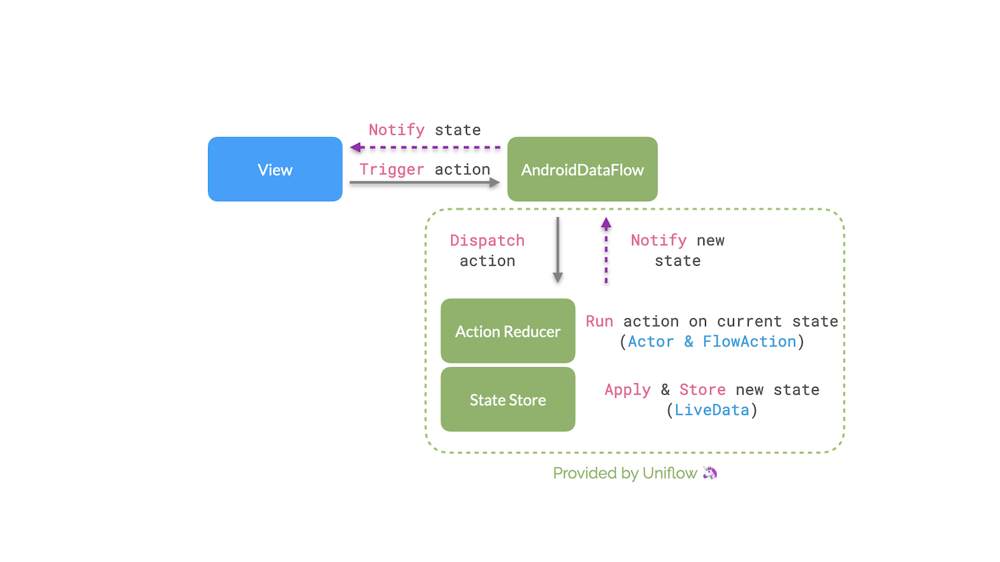

# Uniflow 🦄- Simple Unidirectionnel Data Flow for Android & Kotlin

## Quick intro 🚸

Uniflow help you write your app with a simple unidirectional data flow approach (think states and events) to ensure consistency through the time, and this with Kotlin Coroutines.

Uniflow provides:
* Smart way to write a Data flow in pure Kotlin
* Android extensions to let you just focus on States & Events
* Log all interactions
* Ready for Kotlin coroutines
* Easy to test
* Open to functional programming with [Arrow](https://arrow-kt.io/)

# What is Unidirectional Data Flow?

Unidirectional Data Flow is a concept that means that data has one, and only one, way to be transferred to other parts of the application.

This means that:

- state is passed to the view
- actions are triggered by the view
- actions can update the state
- the state change is passed to the view

The view is a result of the application state. State can only change when actions happen. When actions happen, the state is updated.

Thanks to one-way bindings, data cannot flow in the opposite way (as would happen with two-way bindings, for example), and this has some key advantages:

it’s less error prone, as you have more control over your data
it’s easier to debug, as you know what is coming from where

## Uniflow Architecture Diagram

- Uniflow provides a `DataFlow` (and its Android implementation the `AndroidDataFlow`) 
- An action is a function triggered by the View via the `DataFlow`
- `DataFlow` dispatch each action to the `ActionReducer`
- `ActionReducer` execute action against the `StateStore` to store new states
- New states and events are notified to the View

## Uniflow and MVI

----

## [Back To Documentation Topics](../README.md#getting-started--documentation-)

